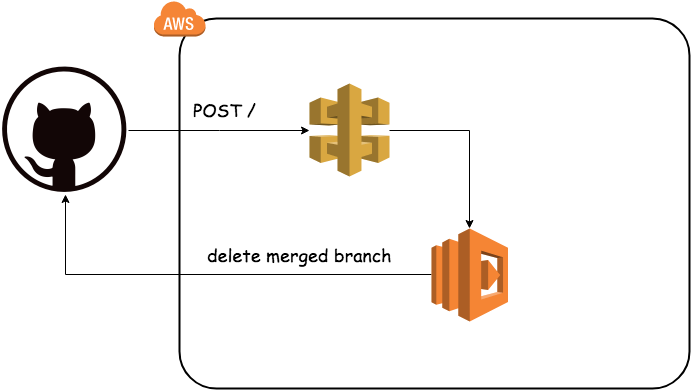

# delete-branch
Automatically delete branch when PR is merged

## Install
Go to the [App page](https://github.com/apps/delete-branch-bot) and select the repository you want to install

## Deployment

1. Set environment variable for terraformuser
    - export TF_VAR_aws_access_key="<your access key>"
    - export TF_VAR_aws_secret_key="<your access secret>"
1. terraform init
1. terraform plan to confirm that it will be created `aws_lambda_function.delete_branch_bot`
1. terraform apply
1. Go to API-Gateway GUI
    - Create New API and select `Regional` Endpoint Type
    - Actions -> Create Method -> POST
    - Select `Lambda Function` Integration type and set `delete_branch_bot` to Lambda Function form
    - Actions -> Deploy API -> Set `prod` stage name
    - You can see the Invoke URL
1. Set Invoke URL to `Webhook URL` in GitHubApp setting
